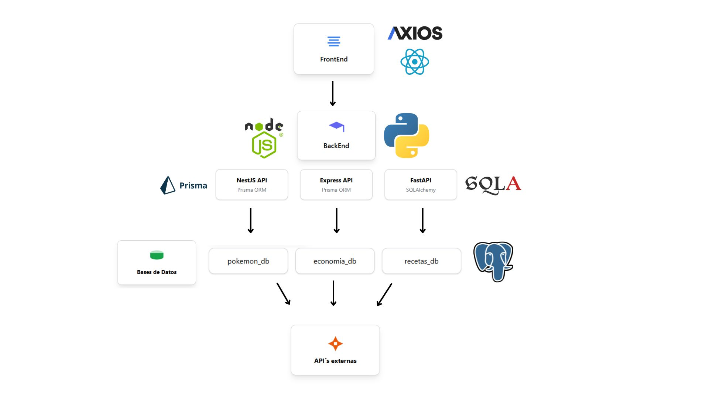

# Descripción del Taller

En este taller se llevó a cabo la creación de una **APK para el cliente de la empresa InfoMovil**, desarrollando una **WebView para Android** que permite a los usuarios acceder al mismo contenido disponible en la página web.

Además, el cliente buscaba **mayor control sobre sus datos**, por lo que ahora la información se consulta **directamente desde bases de datos internas**, en lugar de depender del contenido público del sitio.

---

## Arquitectura del Proyecto

La arquitectura principal del proyecto es la siguiente:




## Tecnologías Utilizadas

- **React** y **Tailwind CSS** para renovar y modularizar el aspecto de la página web.
- **Axios** para realizar las consultas hacia el BackEnd.

---

## Backend

El proyecto cuenta con **3 API independientes**:

- **2 APIs en TypeScript** usando **Node.js**:
  - **NestJS**
  - **Express**
- **1 API en Python** usando la librería **FastAPI**

Para acceder a una documentación más detallada de las API, revise:  
[**AQUÍ**](./api-doc)

Cada API apunta a **una base de datos distinta**, como se aprecia en el diagrama de la arquitectura.

---

## Seeders y Población de Datos

Cada base de datos fue poblada mediante su **seeder correspondiente**, el cual:

- Consulta APIs externas.
- Obtiene la información real utilizada en la página original.
- Almacena estos datos automáticamente en su propia base.

Se aplicó un **límite de consultas externas** para evitar tiempos excesivamente largos durante la etapa de poblamiento.

---

## Dockerización

Todo lo mencionado anteriormente fue **encapsulado dentro de un contenedor Docker**, permitiendo:

- Automatización total del entorno
- Instalación simplificada
- Reproducción del ambiente sin configuraciones manuales

---

# Instalación

Para instalar el proyecto, debe clonar el repositorio y desde la **raíz del proyecto** ejecutar el siguiente comando:


```bash
docker compose up --build
```

Luego que el docker ha sido buildeado y este corriendo, es importante que exponga los siguientes puertos de su maquina por medio de vs Tunnel o por el servicio de tuneles de su preferencia.

| Servicio              | URL                   |
|-----------------------|------------------------|
| RECETAS (FastApi)     | http://localhost:9000/ |
| POKEMON (NestApi)     | http://localhost:9001/ |
| ECONOMIA (ExpressApi) | http://localhost:9002/ |

Cuando ya tenga sus url correspondientes a cada API por ejemplo:

| Servicio              | URL                                                |
|-----------------------|----------------------------------------------------|
| RECETAS (FastApi)     | https://bg6nj47p-9000.brs.devtunnels.ms/           |
| POKEMON (NestApi)     | https://bg6nj47p-9001.brs.devtunnels.ms/           |
| ECONOMIA (ExpressApi) | https://bg6nj47p-9002.brs.devtunnels.ms/           |

Se habilito un script dentro de el frontend para que reemplace los de ejemplo los suyos.

[AQUÍ](./frontend/src/components/api.js)

## APK Incluida en el Repositorio

En el repositorio podrá encontrar la APK (**[AQUÍ]()**).  
El problema es que esta APK fue generada a partir del frontend con **endpoints de ejemplo**.

Para poder probar la aplicación de forma adecuada, es necesario **buildear una WebView propia**.  
Más adelante se detalla cómo realizar este proceso.

---

## Instalación de la APK (Android Studio)

Para instalar la APK disponible en el repositorio, es necesario ejecutar el siguiente comando **con el emulador de Android Studio en funcionamiento**:

```bash
adb install -r 'ruta donde esta su .apk'
```
Luego ya puede echar a andar la APK sin problemas.

Para hacer una build a partir del FrontEnd con los endpoints actualizados:

Desde la raiz del repositorio (DesarrolloWeb)

```bash
cd .\Taller2_\frontend

npm install

npm run build

cd ..

Remove-Item -Path "./cordovaApp/www/*" -Recurse -Force

Copy-Item -Path "./frontend/build/*" -Destination "./cordovaApp/www/" -Recurse -Force

cd cordovaApp

npm install

cordova platform rm android

cordova platform add android

cordova prepare android

cordova run android
```

Todo lo anterior considerando el emulador corriendo, los docker arriba y con el frontend actualizado, no deberia generar problemas.


